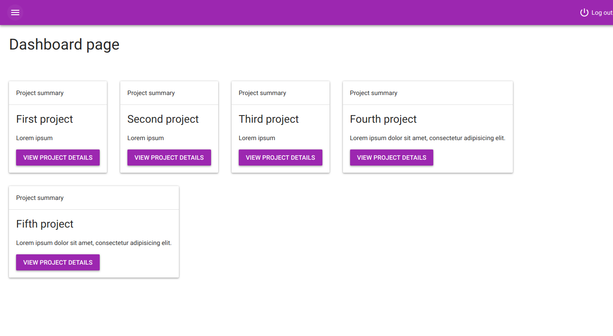
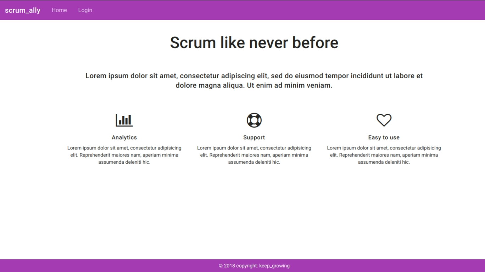
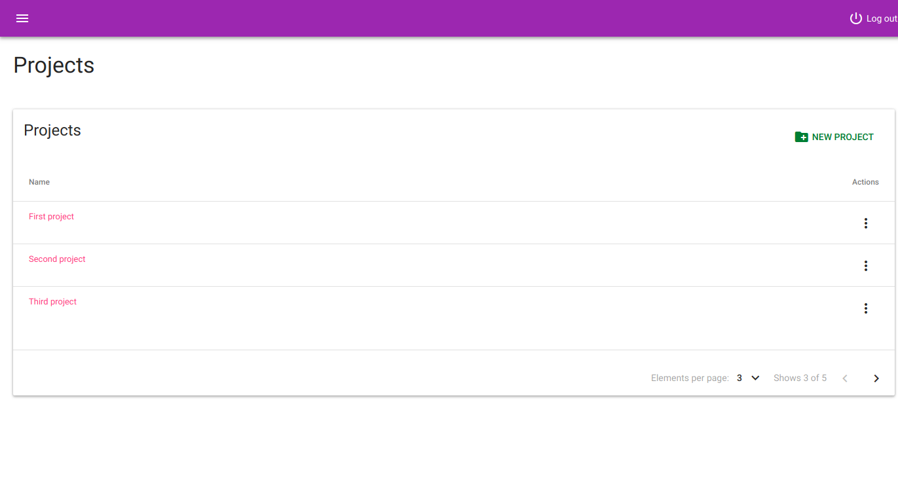
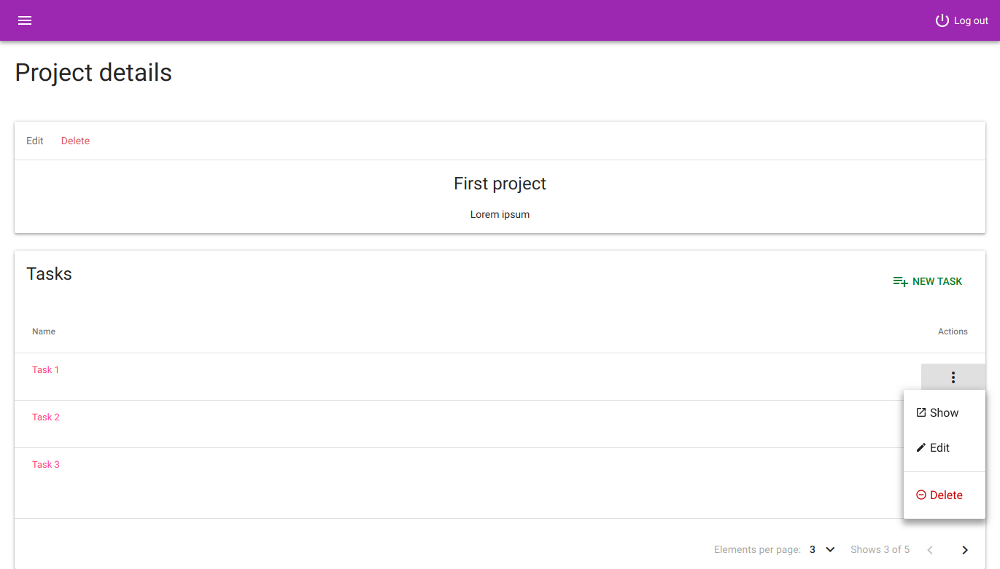
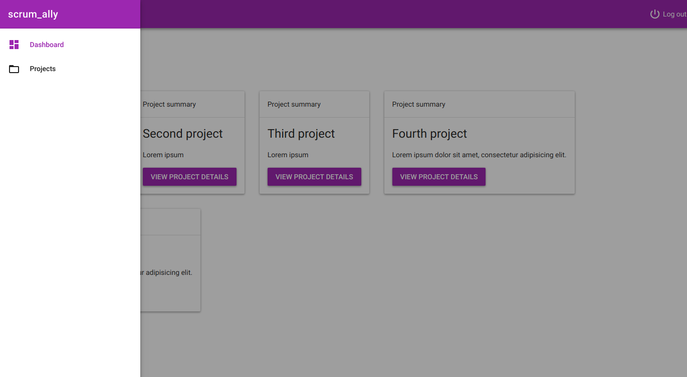
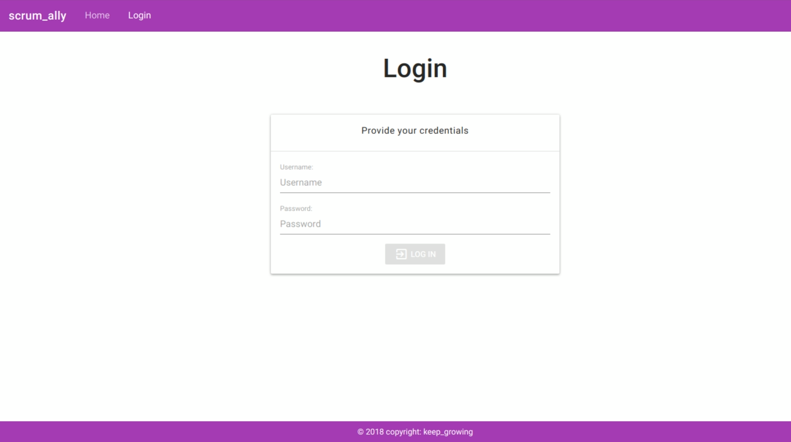

# Scrum_ally

[](https://keepgrowing.in)

Scrum_ally is a web application designed for project management.
This project is a multi-module app, built with Spring Boot and Angular. It can be built into a single jar file using Maven.

## Overview and technical features



The project currently supports creating and managing tasks for multiple projects.

Some of the more interesting technologies used are:

* REST API
* JWT token-based authentication
* Role-based access to resources
* Material design
* Pagination

## Getting Started

To clone this repository, execute the following in the command line:
```bash
$ git clone https://github.com/little-pinecone/scrum-ally.git
```

You can build the application with:
```bash
$ mvn clean install
```

### Create a test user

Endpoint:

```bash
http://localhost:8080/api/users
```
Body:

```json
{
    "userCredentials": {
        "username": "user",
        "password": "test"
    }
}
```

## Running tests

Run all backend tests with the following command in the root directory:
```bash
$ mvn test
```
Run all frontend tests with the following command in the `frontend/src/main/angular` directory:
```bash
$ ng test
```

## API documentation

To see the API docs generated by Swagger build and run the application, and visit the ```http://localhost:8080/swagger-ui.html``` link in your browser.

## Built With

* [Spring Boot 2.1.2](https://start.spring.io/)
* [Angular 8](https://angular.io/)
* [Maven](https://maven.apache.org/)
* [frontend-maven-plugin](https://github.com/eirslett/frontend-maven-plugin)
* [Daemonite's Material UI](https://daemonite.github.io/material/)

## Screenshots








## To do

* HATEOAS
* Managing project members, sharing projects
* Custom messages for successful and failed operations
* Sorting
* Breadcrumbs


## License

This project is licensed under the MIT License - see the [license details](https://opensource.org/licenses/MIT).
